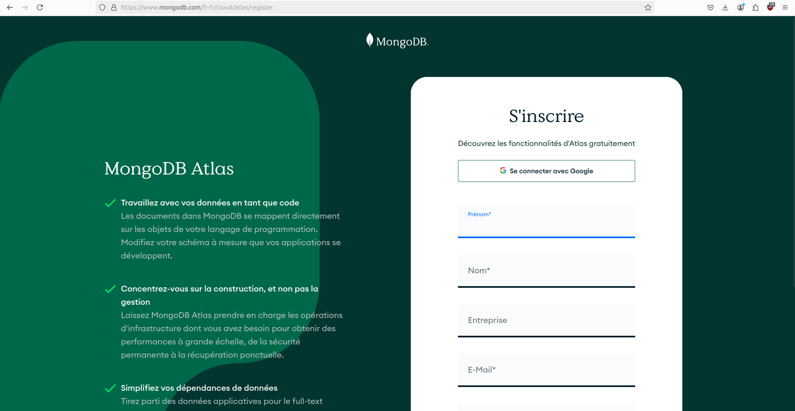
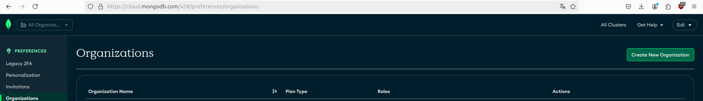

# Tutoriel MongoDB Atlas

> Par: Sidi ESSAADOUNI

## Connexion à MongoDB Atlas

### Création d'un compte

Pour commencer, accédez au site [MongoDB Atlas](https://www.mongodb.com/fr-fr/cloud/atlas/register) et connectez-vous avec Google ou remplissez le formulaire.



### Connexion à votre compte

Une fois votre compte créé, connectez-vous à MongoDB Atlas en utilisant vos identifiants.



## Création d'une organisation

### Accéder à la section "Organisations"

Après vous être connecté, cliquez sur l'icône de profil en haut à droite et sélectionnez "Organisations".


### Créer une organisation

Cliquez sur "Create New Organization" et entrez un nom pour votre organisation.


## Création d'un projet

### Créer un projet

Donnez un nom à votre projet et configurez les tags si nécessaire.


## Création d'un cluster

### Créer un cluster

Cliquez sur create


### Configurer le cluster

Choisissez la région, le fournisseur de cloud, et les options de configuration du cluster. Pour ce tutoriel, nous utilisons le niveau gratuit (M0).


### Création d'un utilisateur de base de données

Créez un utilisateur pour accéder à votre cluster. (<span style="color: red; font-size: 20px; text-decoration: underline;">copiez le mot de passe</span>)


## Se connecter à MongoDB via Python avec recommendations persos

installez les bibliothèques suivantes :

```bash
pip install "pymongo[srv] python-dotenv"
```

Créez un fichier `.env` à la racine de votre projet et ajoutez les informations suivantes :

```bash
# Remplacez <db_password> par le mot de passe de connexion copié précédemment
MONGODB_URI=mongodb+srv://test:<db_password>@cluster0.mongodb.net/?retryWrites=true&w=majority
```

Utilisez la chaîne de connexion pour interagir avec MongoDB à partir d'un script Python.

```python
from pymongo.mongo_client import MongoClient
from pymongo.server_api import ServerApi
from dotenv import load_dotenv
from os import getenv

load_dotenv()
uri = getenv("MONGODB_URI")

# Créez un nouveau client et connectez-vous au serveur
client = MongoClient(uri, server_api=ServerApi('1'))

# Envoyez un ping pour confirmer une connexion réussie
try:
    client.admin.command('ping')
    print("Pinged your deployment. You successfully connected to MongoDB!")
except Exception as e:
    print(e)
```
